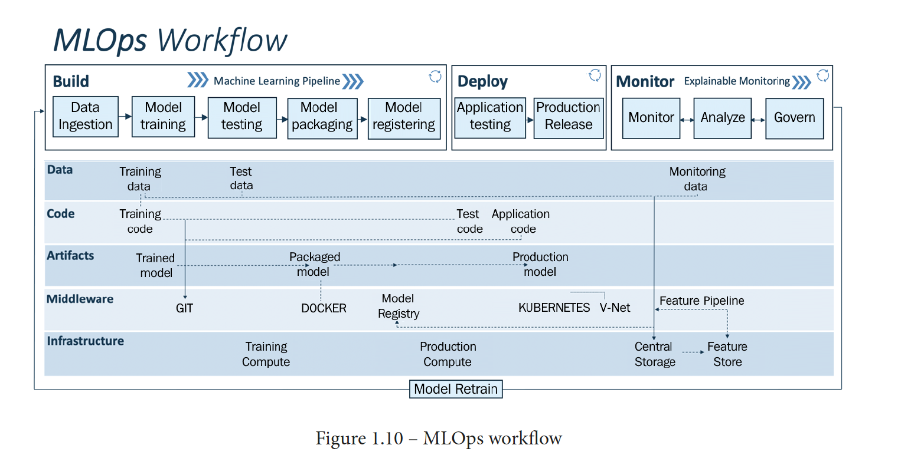

# WecloudData
## MLOps Training
### End-to-end model training and deployment using PyTorch Lightning, Fast API and Docker
#### Multi-label text classification
##### Prepared by WecloudData

In this project, we will train and deploy a PyTorch machine learning model to production environment using FastAPI and Docker. The goal is to serve a trained model as API endpoints inside a Docker container with CUDA support, on a local and remote cloud linux machine. 

This tutorial aims to prepare Data Scientists or Machine Learning Engineers for ML Model deployment.



Topics cover in this project:

- Text data collection and preprocessing (Data Ingestion)
- PyTorch Lightning (Model Training / Testing / Packaging)
- FastAPI & pydantic (Application API / Testing Code)
- uvicorn & gunicorn (Web Server)
- Writing PyTest test cases (Application and Unit Testing)
- Building and deploying Docker Image locally and remotely with CUDA (Production Deployment)

Folder Structure
```
|── Dockerfile
├── README.md
├── app
│   ├── __init__.py
│   ├── config.py
│   ├── log.ini
│   ├── model.py
│   ├── predict.py
│   ├── schema.py
│   ├── serve.py
│   └── tests
│       ├── __init__.py
│       ├── __pycache__
│       └── test_api.py
├── data
│   ├── dump
│   ├── post_categories
│   │   └── dataset.csv
│   └── scraped_data
├── docker_build.sh
├── docker_run_local.sh
├── model
│   ├── bert_pretrained
│   ├── model_1.pt
│   └── tokenizer
├── requirements.txt
├── start.sh
├── training
│   ├── checkpoints
│   ├── lightning_logs
│   └── training.ipynb
└── utils
    ├── create_post_categories_dataset.ipynb
    ├── scrape
    ├── scraper.py
    └── scripts
        ├── test_api.sh
        └── turn_on_endpoint.sh
```
- *app/* hosts the FastAPI and inference Python script
- *model/* consists of the PyTorch model, tokenizer and pretrains
- *utils/* consists of various Python and Bash scripts for data creation and scraping and endpoint setup and testing
- *training/* contains the example PyTorch model for this project

### Additional References
This project is inspired by the following resources:
- https://medium.com/@mingc.me/deploying-pytorch-model-to-production-with-fastapi-in-cuda-supported-docker-c161cca68bb8
- https://github.com/kunal-bhadra/Multilabel-Text-Classification-BERT/blob/master/MultiLabel_Text_Classification.ipynb
- https://fastapi.tiangolo.com/deployment/docker/
- https://microsoft.github.io/code-with-engineering-playbook/machine-learning/ml-testing/
- https://ml-ops.org/content/mlops-principles